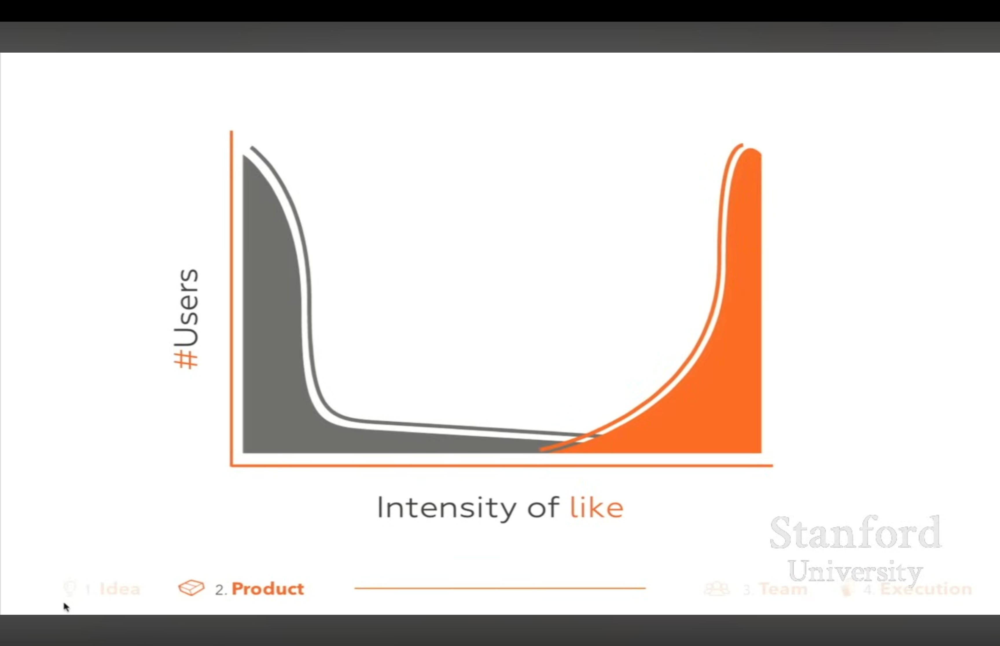

- Starts with Sam’s love—users chart.

- Continue with capturing the market share.

  - 1,000 engineers
  - dotted box line

- what does scaling to the right mean in B2B vs B2C context

- Scalable architectures vs scalable features

  - B2C → how the systems endure 1,000,000 users
  - B2B → how the systems endure 1,000,000 combinations of use case

- Make something that small subset of people love, but scalable → ensures growth to majority market share adoption.
