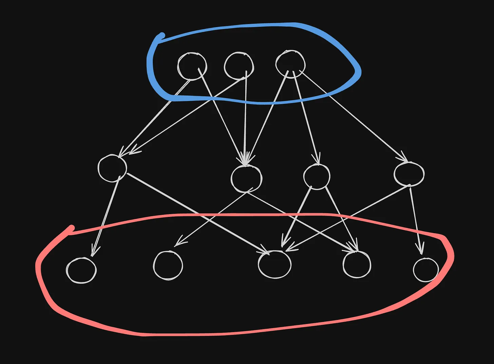
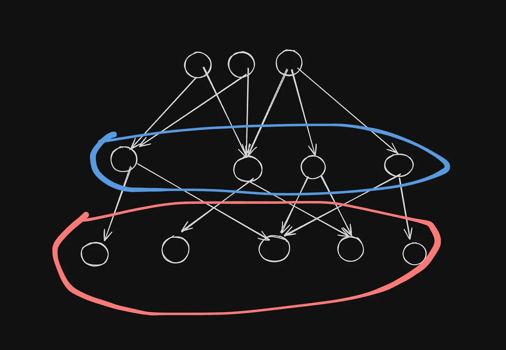

The primary reasons, as far as I observed, on the hate of Leetcode-style questions in interview are it's not used in the job, it takes time to learn and away from the job itself.

I think the this is understandable and reasonable. What I'd like to propose is the one reason why these hate came up to be are caused by _lazy interviewers_ which I assume they took question(s) from the bank and threw it to the candidate. Test whether they can climb them as expected or not.

I already disliked the term "Leetcode question" itself as a replacement for data structure & algorithm question.

It's not about whether the candidate can arrive to the finish line or not. Rather, we should be looking at the _delta_. That is, given starting point and a hard situation, i.e. the question at hand, how far can the candidate arrive at the finish line.

The candidate who has the highest delta should be the one selected. I'd propose the delta as the number one measurement because it reflects the work environment the most. Work setting is about having some problems that needs to be solved in a very dynamic environment. You can do a lot of activities to achieve the goals such as code the implementation, design the solution, do the initial PoC to derisk a project, talk to your manager.

[Excalidraw](https://excalidraw.com/#json=fNrrteV7AON2zdBQL3uDf,-ofYKZJLRxJsiVAQdcUzcg)

All of those activities cannot be tested in a constrained 45 minutes interviews. So, instead of testing the real activities, opt to test for the existence of the fundamental, core traits that supports the behaviours we would like to see.

The simplest representation I can think of is we can represent the day-to-day activities we do in work as the circles in red. While the circles in blue are the fundamental, core traits that support the activities.

The core essence of data structure & algorithm (DSA) questions are to test the fundamentals of the candidates in hope that it'll cover enough ground for the downstream day-to-day activities.

But, Leetcode "practicioner" rip out that essence from (DSA) questions and make it so it's like a tree monkey climbing simulator. It's like a industrialized version of a hand-made crafts.

There's also another dimension of the question being "too pure" or too far from the practical skills applied daily.

Hence, conducting these kind of interviews is actually hard. First, the interview skill issue. Second, the nature of question being too far away from practical day-to-day skills.

With all of the context at hand, I would propose a solution for the 2nd problem we have at hand. First, we should understand what's the requirements for the actual technical skills involved. Second, take one abstraction level higher from that layer of technical skills.

[Excalidraw](https://excalidraw.com/#json=fNrrteV7AON2zdBQL3uDf,-ofYKZJLRxJsiVAQdcUzcg)

Using the same simplified representation of people activities, skills, and traits, instead of testing for the root nodes which is 2 level away, we test for the circles in blue, which is 1 level away from practical day-to-day skills.

To make it concrete...

Recently we need to hire a [frontend engineer](/software-engineering-iq/) with Typescript and React tech stacks. What I asked is React State Tree Traversals of components are represented as tree, how state propagates from top to bottom, calculating final state renders, and updating those states. It's a simplified version of how React manage states.

I can ask the candidate to implement a website. That'll take a while, but it'll test whether they can use React or not. But not much signal besides that. We're not sure of how far their debugging skills, their thinking capacity, etc.

One abstraction higher on that is testing whether they understood React internal working. How are the states being managed in React? Understand the inner principle, the initial reasoning why it the way it is is crucial on seeing whether the candidate has a strong reasoning skills. Being able to model a tree, doing "mental gymnastic" on the tree test whether the candidate has a strong mental model skill.

TODO: refine
